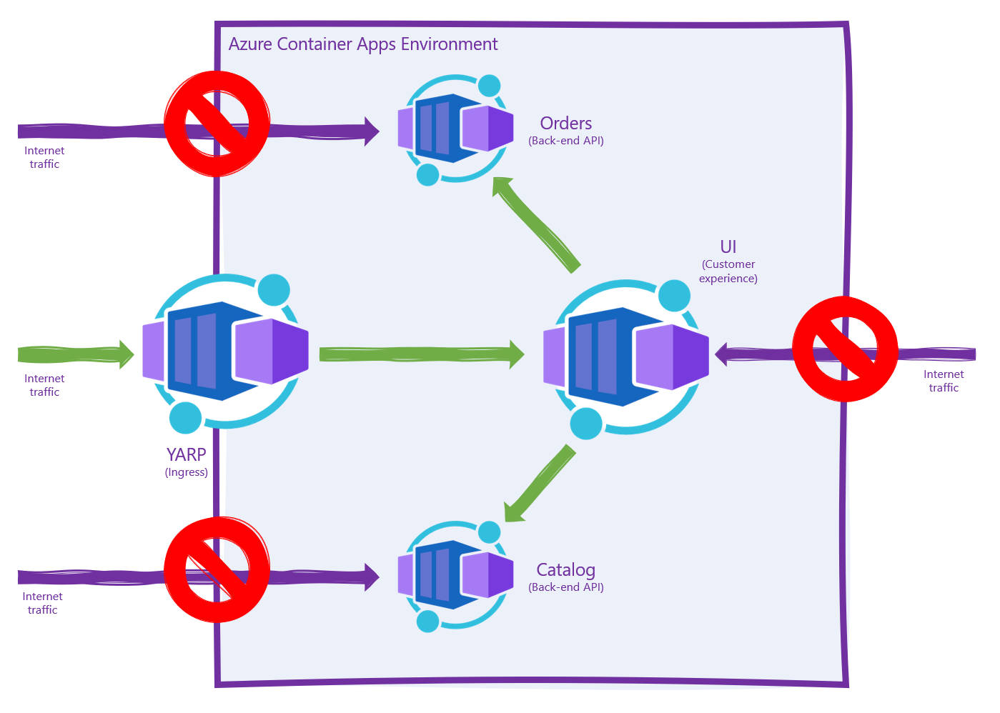

# .NET with YARP on Azure Container Apps

This repository contains a simple scenario built to demonstrate how ASP.NET Core 6.0 can be used to build a cloud-native application hosted in Azure Container Apps. The repository consists of the following projects and folders:

* Catalog API - this is an ASP.NET minimal API project with one endpoint. 
* Orders API - this is an ASP.NET minimal API project with one endpoint. 
* UI - an ASP.NET Blazor Server app that calls out to both the Catalog and Orders API and renders their status.
* Proxy - a YARP proxy project that proxies to the UI app.
* ```deploy``` folder - this folder contains a series of [Azure Bicep](http://aka.ms/bicep) templates that can be used to create the application and deploy it.
* ```setup.ps1``` - this file is a one-stop way for you to deploy the app to your own Azure subscription so you can try the scenario. 

## Prerequisites

* .NET 6.0
* The Azure CLI
* An Azure subscription
* Docker
* PowerShell *(GitHub Actions will replace this prerequisite soon)*

## Setup

1. Clone this repository.
2. Sign in to your Azure subscription using the `az login` command.
3. If you have more than 1 Azure subscription, make sure you're targeting the *right* Azure subscription by using the `az account show` and `az account set -s <subscription-id>` commands.
4. From the root of this repository, run `./setup.ps1`. 

## Local Development with Docker Compose

You can use Docker Compose to run the solution locally, by selecting "docker compose" from the project list in the toolbar.

## Local Development as .exe

You can run the solution locally as plain .exe by right clicking on the solution in Solution Explore and selecting "Set Startup Projects" and selecting "Multiple Startup Projects", and setting each project to "Start" except for the docker compose project.

You also need to add the following entries to your `hosts` file (located in `%Windows%\System32\drivers\etc`):

```
127.0.0.1 ui
127.0.0.1 catalog
127.0.0.1 orders
```

## Topology diagram

The resultant application is an Azure Container Environment-hosted set of containers - the `catalog` API, the `orders` API, the `ui` Blazor Server front-end, and the `yarp` reverse proxy app.



Internet traffic should not be able to directly access either of the back-end APIs, or the Blazor Server interface, as each of these containers is marked as "internal ingress only" during the deployment phase. Internet traffic hitting the `yarp.<your app>.<your region>.azurecontainerapps.io` URL should be proxied to the `ui` container, which in turn makes outbound calls to both the `catalog` and `orders` APIs within the Azure Container Apps Environment. The `yarp` Azure Container App should be the only app in the environment marked with "external ingress," as it should proxy to the UI and thus, shield the back-end from internet traffic.

